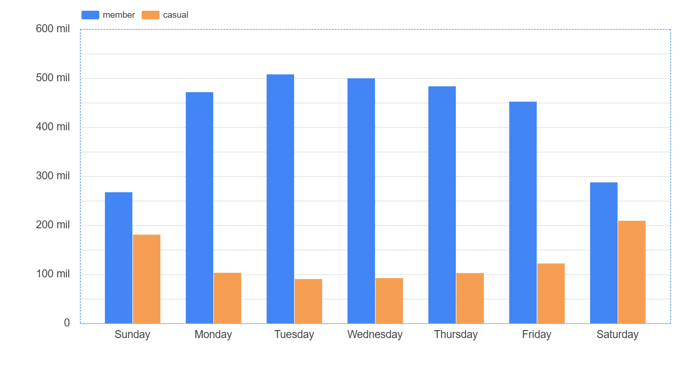

# Costumer Behavior & Conversion Analysis for Micro-Mobility Services
**Executive Data Analysis Report — Cyclistic Case Study**

**Prepared for:** Director of Marketing and Cyclistic Executive Team  
**Project:** Google Data Analytics Capstone — User Conversion Strategy  
**Tools Used:** Google BigQuery (SQL) and Looker Studio (Visualizations)  

---

## 📌 Executive Summary

This study analyzes 12 months of historical trip data from Cyclistic to identify behavioral differences between casual riders and annual members, aiming to design targeted marketing strategies for annual membership conversion. 

Data processing reveals distinct usage motivations: members utilize Cyclistic primarily for daily commuting (short, consistent trips during weekday rush hours), whereas casual riders use the service for leisure and tourism (longer rides peaking on summer weekends and concentrating around coastal and tourist hubs).

Based on these findings, strategic initiatives are proposed to drive conversion, including a credit-back program for summer pass purchases, geo-targeted marketing at top casual stations, and gamified ride-time rewards.

---

## 🏢 Business Context & Problem

Cyclistic operates a bike-share network in Chicago. While flexible pricing options attract diverse user segments, financial analysis shows that annual members are significantly more profitable than casual riders. To maximize long-term business growth, Cyclistic needs to convert casual riders into annual members.

### Key Business Questions
1. How do annual members and casual riders use Cyclistic bikes differently?
2. Why would casual riders buy a Cyclistic annual membership?
3. How can Cyclistic use digital media to influence casual riders to become members?

---

## 🛠️ Tools & Methodology

* **Data Ingestion & Unification:** Google BigQuery (SQL) — Consolidated 12 months of historical Divvy trip data across legacy schemas into a unified dataset (`cyclistic_12_months_raw`).
* **Data Cleaning & Derivation:** Google BigQuery (SQL) — Calculated `ride_length_minutes`, derived date dimensions, standardized user labels, and filtered out false starts (< 1 min) and system outliers ($\ge$ 24 hrs) into `cyclistic_12_months_clean`.
* **Data Visualization & Reporting:** Looker Studio — Built interactive dashboards to model weekly distribution, seasonality, and geographical hubs.

---

## 📊 Key Visualizations & Findings

### 1. Weekly Ride Volume & Duration Analysis

<p align="center">
  
</p>

> **Key Analytical Insights:**
> * **Commuter vs. Leisure Split:** Members maintain high trip volume Monday through Friday (peaking during 7–9 AM and 4–6 PM rush hours), while casual ride volume surges on weekends.
> * **Duration Disparity:** Casual riders spend an average of **~39 minutes** per trip—more than **3x longer** than annual members (**~12 minutes**)—highlighting low time-sensitivity and recreation-driven use.

---

### 2. User Segment Comparison & Seasonality

Evaluating user behavior across seasonal and operational dimensions shows clear market segmentation:

| Metric / Dimension | Annual Members (`member`) | Casual Riders (`casual`) |
| :--- | :--- | :--- |
| **Primary Intent** | Daily Commuting / Utility | Leisure, Recreation & Tourism |
| **Peak Activity Days** | Monday – Friday (Workdays) | Saturday & Sunday (Weekends) |
| **Avg. Ride Duration** | ~12 minutes (Short & stable) | ~39 minutes (Long & variable) |
| **Seasonal Resilience** | High (Sustained baseline in winter) | Low (Collapses during cold months) |
| **Top Departure Hubs** | Transit & Commercial Stations | Tourist Attractions & Waterfront Parks |

---

## 🚀 Strategic Recommendations for Cyclistic

1. **"Summer Pass to Membership" Credit Program**
   * **Rationale:** Casual rides peak dramatically during summer months.
   * **Action:** Allow casual riders to apply 100% of single-pass or day-pass expenditures incurred during May–September as a direct credit toward purchasing an annual membership.

2. **Geo-Targeted Marketing at Top Casual Hubs**
   * **Rationale:** Casual trips originate heavily from specific tourist hubs like *Streeter Dr & Grand Ave* and *Lake Shore Dr*.
   * **Action:** Deploy digital screens, physical signage, and geofenced mobile ads specifically at the Top 10 casual departure stations to capture high-intent users during peak hours.

3. **Gamified Ride-Time Rewards ("Ride & Save")**
   * **Rationale:** Casual riders log substantially longer ride durations (~39 min average).
   * **Action:** Introduce an in-app reward system where minutes spent riding accumulate points redeemable for annual membership discounts, incentivizing frequent leisure riders to transition into members.

---

## ⚠️ Data Limitations

* **Lack of Personally Identifiable Metadata:** Due to privacy regulations, individual user IDs are not tracked across single passes, making it impossible to determine how many casual rides belong to the same repeat user.
* **Absence of Demographic & Financial Data:** The open dataset does not include rider age, income level, or precise residence locations, limiting advanced demographic segmentation.
* **Exogenous Weather Variables:** Temperature and precipitation data were not integrated into the schema, requiring qualitative assumptions regarding winter volume declines.

---

## 📁 Repository Structure

```text
cyclistic-user-conversion-analysis/
├── README.md                      <-- Main executive summary and report
├── sql/                           <-- BigQuery SQL scripts
│   ├── 01_data_ingestion.sql      <-- Cloud Storage loading commands
│   ├── 02_data_cleaning.sql       <-- Schema alignment & quality filters
│   └── 03_exploratory_analysis.sql<-- Weekly trends, duration & top stations
├── reports/                       <-- Documented deliverables
│   └── Cyclistic_Executive_Report.pdf
└── images/                        <-- Visualizations & charts
    ├── weekly_ride_volume.png
    ├── avg_ride_duration.png
    └── top_stations.png
